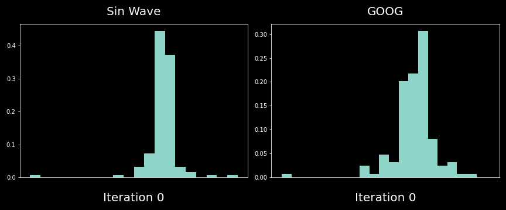

# 🌊 Chaos Evaluator

For many problems, it's good to first ask (a) "how easy it can be predicted", and then ask (2) "how far into the future do we want to predict it". This package wants to help with question (a).

**Chaos Evaluator** provides tools to evaluate the chaos in time series data and find the most stable interval. Read my [blog](https://espaceship.medium.com/map-the-chaos-in-s-p500-b51e67a800bc) about this.



## Installation

```
!git clone https://github.com/easonanalytica/chaos_evaluator.git
pip install .
```

## Usage

Here's a basic example of how to use the ChaosEvaluator:

```python
import pandas as pd
from chaos_evaluator import ChaosEvaluator

# Load your data
df = pd.read_csv('your_data.csv')

# Create an evaluator
evaluator = ChaosEvaluator(visualize=True)

# Evaluate the chaos
results = evaluator.evaluate(df, normalize=True)

print(results)
```
